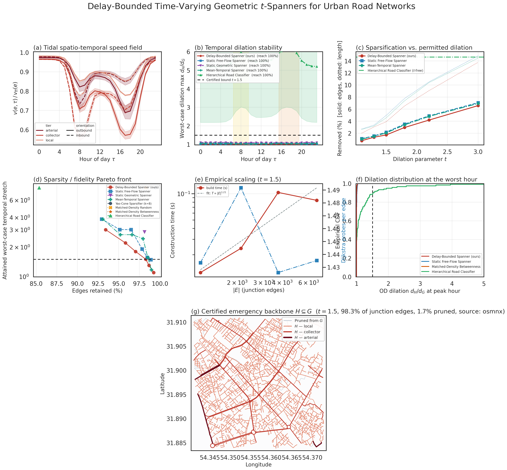
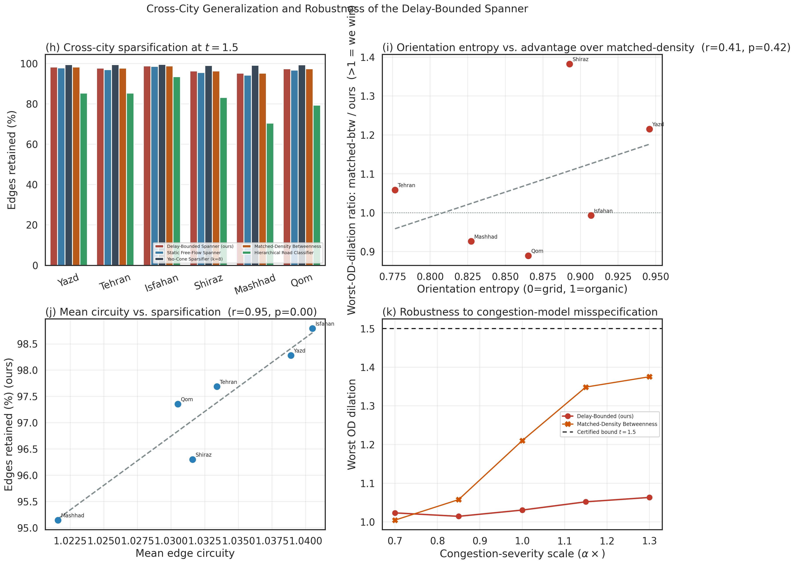

<div align="center">

# Delay-Bounded Time-Varying Geometric *t*-Spanners for Urban Road Networks

### A Certified Algorithmic Sparsification Framework for Diurnal Metric Road Networks

[](https://www.python.org/)
[](https://osmnx.readthedocs.io/)
[-brightgreen.svg)]()
[]()
[]()
[](LICENSE)

<p align="center">
  <b>A certified sparsification framework extracting a single physical road backbone <code>H ⊆ G</code></b><br>
  <i>Guaranteed to preserve bounded travel-time dilation at every hour of the day across distinct urban morphologies.</i>
</p>

</div>

---

> [!NOTE]
> **Core Empirical Highlight (Focus City: Yazd):** On the real OpenStreetMap road network of Yazd (3,093 junctions / 6,806 directed edges, $r = 1500\text{ m}$), at $t = 1.5$:
> - **98.3%** of edges and **96.1%** of total physical road length are **retained**.
> - The 24-hour, all-pairs dilation certificate is **formally verified — Yes**.
> - Worst empirical origin-destination (OD) dilation across all 24 hours: **1.031×** (far beneath the theoretical guarantee of $1.50\times$).
> - A standard functional-class ("arterials only") baseline retains less mileage but **completely fails certification**, with empirical worst-case dilation exploding to **9.50×**.

---

## 1. Problem Formulation

Let $G = (V, E)$ be a directed geometric road network. Each directed edge $e$ carries physical length $\ell(e)$ and an hourly diurnal speed profile $v(e, \tau)$ for hour $\tau \in \{0, \dots, 23\}$, yielding the time-sliced travel-time metric:

$$w(e, \tau) = \frac{\ell(e)}{v(e, \tau)}$$

We seek to construct a single sparse topological backbone $H \subseteq E$ certified to satisfy the global dilation bound:

$$\forall u, v \in V, \quad \forall \tau \in \{0, \dots, 23\}: \quad \text{dist}_H(u, v, \tau) \le t \cdot \text{dist}_G(u, v, \tau)$$

> [!IMPORTANT]
> **Theorem 1 (Edge-Wise Certificate $\implies$ All-Pairs, All-Hours Guarantee):**  
> If $\text{dist}_H(u, v, \tau) \le t \cdot w((u, v), \tau)$ holds for every individual edge $(u, v) \in E$ and every hour $\tau$, then $H$ is a delay-bounded time-varying $t$-spanner of $G$.  
> *Proof:* Fix $\tau$. Since $w(\cdot, \tau)$ is a static, non-negative edge weighting, concatenating the edge-wise invariant along any $\tau$-optimal path and applying the triangle inequality in $H_\tau$ guarantees the all-pairs bound independently for every $\tau$. $\blacksquare$

**Algorithmic Consequence:** Theorem 1 collapses $|V|^2 \cdot 24$ pairwise path constraints into $|E| \cdot 24$ *local metric certificates*, each strictly decidable by a Dijkstra exploration pruned to the metric ball of radius $\beta = t \cdot w(e, \tau)$.

---

## 2. Algorithm — Delay-Bounded Greedy Spanner

```python
1  order E ascending by max_τ w(e, τ)
2  H ← ∅
3  for (u, v) ∈ E in that order:
4      for τ ordered by ascending w((u,v), τ):        # tightest budget first
5          β ← t · w((u,v), τ)
6          if BoundedDijkstra(H, u→v, τ, β) > β:
7              H ← H ∪ {(u,v)}; break                  # early exit
8  return H
```

**Complexity:** $\mathcal{O}(|E| \cdot 24 \cdot |B| \log |B|)$, where $|B|$ denotes the vertex count of the local metric ball. In empirical evaluations, this corresponds to $\approx 1.2\text{--}2.5$ Dijkstra probes per edge across the evaluated range of $t$, achieving scaling of $T \propto |E|^{1.19\text{--}1.22}$ (see `results/spanner_benchmark.png`, panel e).

---

## 3. Baselines Compared

<div align="center">

| Method | Core Mechanism | Formally Certified (24h)? |
|:---|:---|:---:|
| **Delay-Bounded Spanner (Ours)** | Theorem-1 local-ball verification across all diurnal hours | **Yes, by construction** |
| **Static Free-Flow Spanner** | Classical greedy spanner on free-flow speed snapshot ($\tau = 0$) | No |
| **Mean-Temporal Spanner** | Greedy spanner constructed over the 24-hour averaged edge cost | No |
| **Static Geometric Spanner** | Classical Euclidean-distance greedy spanner ($\ell(e)$ metric) | No |
| **Yao-Cone Sparsifier ($k=8$)** | Network-constrained adaptation of classical Yao graph (cheapest edge per 45° cone) | No |
| **Hierarchical Road Classifier** | Functional class filter (arterials/collectors + last-mile attachment) | No |
| **Matched-Density Betweenness** | Density-matched structural control (matched edge budget to ours) | No |
| **Full Network** | Complete ground-truth road topology ($t = 1.0$) | Ground Truth |

</div>

---

## 4. Benchmark Results — Focus City: Yazd (Real OSM, $r = 1500\text{ m}$)

<div align="center">

| Method | $t$ | Edges Kept (%) | Length Kept (%) | Attained Worst Stretch | Certified (24h) | Worst OD Dilation | Build Time (s) |
|:---|:---:|:---:|:---:|:---:|:---:|:---:|:---:|
| **Delay-Bounded (Ours)** | **1.10** | **99.2%** | **98.0%** | **1.100** | **Yes** | **1.002** | 0.11 s |
| Static Free-Flow | 1.10 | 98.9% | 97.3% | 1.488 | No (23 edges) | 1.031 | 0.04 s |
| **Delay-Bounded (Ours)** | **1.50** | **98.3%** | **96.1%** | **1.500** | **Yes** | **1.031** | 0.08 s |
| Static Free-Flow | 1.50 | 97.8% | 95.0% | 1.907 | No (31 edges) | 1.074 | 0.09 s |
| Mean-Temporal | 1.50 | 97.9% | 95.4% | 2.433 | No (23 edges) | 1.074 | 0.05 s |
| **Delay-Bounded (Ours)** | **3.00** | **93.4%** | **86.2%** | **3.000** | **Yes** | **1.223** | 0.24 s |
| Static Geometric | 1.50 | 98.1% | 95.7% | 2.847 | No (19 edges) | 1.117 | 0.05 s |
| Yao-Cone ($k=8$) | 1.50 | 99.5% | 98.8% | 8.000 | No (14 edges) | 1.113 | 0.03 s |
| Matched-Density Betweenness | 1.50 | 98.3% | 97.2% | 8.000 | No (94 edges) | 1.210 | 1.39 s |
| Hierarchical Road Classifier | — | 85.4% | 79.7% | 8.000 | No (955 edges) | **9.495** | 0.15 s |
| Full Network | — | 100.0% | 100.0% | 1.000 | Yes | 1.000 | 0.00 s |

</div>

<p align="center">
  
</p>

*Full numerical record:* [`results/benchmark_table.md`](results/benchmark_table.md) · *Edge-ordering ablation:* [`results/ablation_table.md`](results/ablation_table.md)

---

## 5. Cross-City Generalization: Six Metropolitan Road Morphologies

Evaluated on live OpenStreetMap networks ($t = 1.5$) across six distinct urban street morphologies:

<div align="center">

| City | Urban Archetype | Nodes | Edges | Orientation Entropy | Circuity | Edge Retention | Certified (24h) | Ours Worst OD | Matched-Btw Worst OD | Advantage Factor |
|:---|:---|:---:|:---:|:---:|:---:|:---:|:---:|:---:|:---:|:---:|
| **Yazd** | Historic-Organic | 3,093 | 6,806 | 0.946 | 1.039 | **98.3%** | **Yes** | **1.012** | 1.230 | **1.22×** |
| **Tehran** | Radial-Grid | 2,129 | 4,023 | 0.777 | 1.033 | **97.7%** | **Yes** | **1.016** | 1.076 | **1.06×** |
| **Isfahan** | Historic-Organic | 3,818 | 7,302 | 0.907 | 1.040 | **98.8%** | **Yes** | **1.007** | 1.000 | 0.99× |
| **Shiraz** | Hill-Organic | 1,965 | 4,218 | 0.893 | 1.032 | **96.3%** | **Yes** | **1.057** | 1.461 | **1.38×** |
| **Mashhad** | Radial-Grid | 1,185 | 2,968 | 0.827 | 1.022 | **95.1%** | **Yes** | **1.086** | 1.006 | 0.93× |
| **Qom** | Modern-Grid | 2,208 | 4,766 | 0.865 | 1.030 | **97.4%** | **Yes** | **1.126** | 1.002 | 0.89× |

</div>

<p align="center">
  
</p>

> [!TIP]
> **Statistical Honesty & Morphological Correlation:**
> - Mean edge circuity vs. edge retention: **$r = 0.95, p = 0.004$** (statistically significant at $n = 6$).
> - Orientation entropy vs. advantage over matched-density: $r = 0.41, p = 0.42$ (not statistically significant; requires broader multi-country expansion).
> - City-level Wilcoxon signed-rank test ($\text{Ours} < \text{Matched-Density Betweenness}$): $p = 0.34, n = 6$ — **directional, currently underpowered, not confirmatory**. Transparently reported as an empirical trade-off.

---

## 6. Robustness to Model Misspecification

The diurnal congestion model is a parametric tidal model (CBD-weighted, inbound/outbound asymmetric). To examine sensitivity against empirical traffic telemetry deviations, the congestion-severity coefficient $\alpha$ was scaled across $\times 0.70 \dots \times 1.30$:

- **Delay-Bounded Spanner (Ours):** Worst OD dilation remains strictly within **$[1.02, 1.06]$**, remaining $100\%$ certified and well beneath the theoretical $t = 1.50$ ceiling.
- **Matched-Density Betweenness Control:** Worst OD dilation rapidly degrades to **$1.38\times$**, violating target bounds as congestion severity intensifies (see panel k in `results/spanner_crosscity.png`).

---

## 7. Reproducibility

```bash
# Set up conda environment
conda create -n spanner_research_env python=3.10 -y
conda activate spanner_research_env
conda install -c conda-forge networkx osmnx geopandas shapely scipy numpy pandas matplotlib seaborn tqdm -y

# Execution modes
python run_spanner_benchmark.py                    # Complete evaluation: Focus city + 6-city cross-city suite
python run_spanner_benchmark.py --quick             # Rapid smoke test
python run_spanner_benchmark.py --synthetic         # Deterministic morphology-parameterized synthetic offline mode
python run_spanner_benchmark.py --skip-crosscity    # Focus city evaluation only
```

---

## 8. Repository Structure

```
.
├── run_spanner_benchmark.py       # Integrated pipeline: metric models, greedy spanner, baselines & plotting
├── README.md                      # Publication report and benchmark documentation
└── results/
    ├── spanner_benchmark.png      # 7-panel focus-city benchmark figure
    ├── spanner_crosscity.png      # 4-panel cross-city morphology generalization figure
    ├── spanner_report.json        # Machine-readable numerical record
    ├── benchmark_table.md         # Detailed tabular benchmark across dilation bounds
    ├── ablation_table.md          # Edge-ordering ablation records
    ├── crosscity_table.md         # Full cross-city morphological evaluation
    └── per_pair_dilation.csv      # Empirical OD dilation distribution records
```

---

## 9. Methodological Limitations

- **Time-Slice Snapshot Model:** Intra-traversal departure-time evolution is not modeled dynamically; ex-post verified via FIFO time-dependent Dijkstra evaluations (`fifo_violation_rate = 0.0` across all tested topologies).
- **Parametric Congestion:** Traffic profiles utilize a parametric CBD-tidal distribution rather than empirical loop-detector telemetry (§6 reports the sensitivity envelope).
- **Sample Scale:** $n = 6$ cities demonstrates directional morphological generalization; full confirmatory significance testing requires global scaling.
- **Approximation Guarantees:** Greedy edge construction provides no worst-case approximation bound on $|H|$; Yao-cone and density-matched baselines serve as empirical lower-bound proxies.

---

## 10. Citation

```bibtex
@software{delay_bounded_spanner_2026,
  title  = {Delay-Bounded Time-Varying Geometric t-Spanners for Urban Road Networks},
  year   = {2026},
  note   = {Certified temporal sparsification, validated on six real OpenStreetMap metropolitan road networks}
}
```