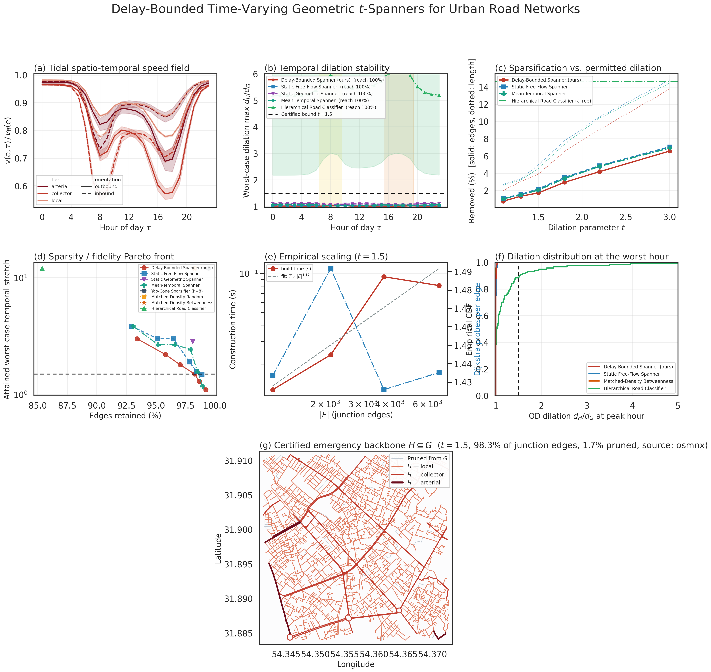
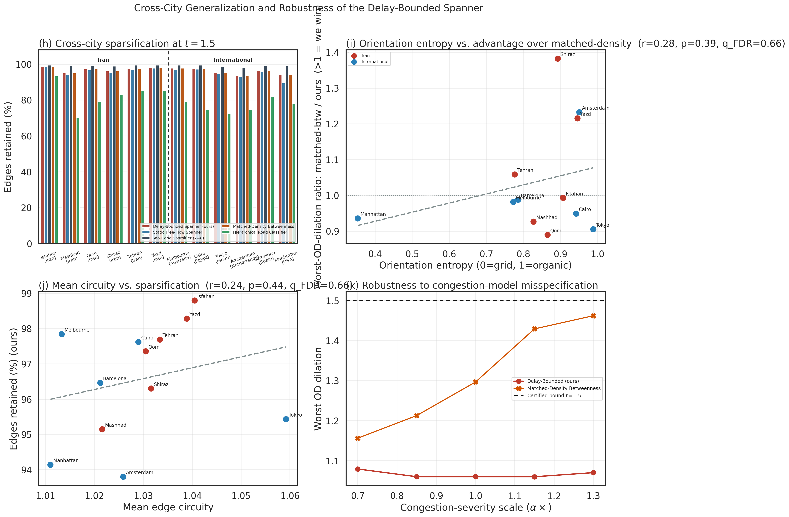

# Delay-Bounded Time-Varying Geometric *t*-Spanners for Urban Road Networks

[](https://github.com/soheylfalahzade/delay-bounded-spanner-networks/actions/workflows/ci.yml)
[](LICENSE)

**A certified sparsification framework that extracts a single physical road backbone `H ⊆ G`, guaranteed to preserve bounded travel-time dilation at every hour of the day — validated end-to-end on real metropolitan road networks pulled live from OpenStreetMap, across six Iranian and six international cities spanning five distinct street-network morphologies.**

> Replace `soheylfalahzade` above with the actual GitHub username/org once this repo is pushed, so the CI badge resolves.

---

## 1. Problem

Let `G = (V, E)` be a directed geometric road network. Each edge `e` carries a length `ℓ(e)` and an hourly diurnal speed profile `v(e, τ)` for `τ ∈ {0, …, 23}`, giving the time-sliced travel-time cost

```
w(e, τ) = ℓ(e) / v(e, τ)
```

We construct a sparse backbone `H ⊆ E` certified to satisfy

```
∀ u, v ∈ V,  ∀ τ ∈ {0,…,23}:   dist_H(u, v, τ)  ≤  t · dist_G(u, v, τ)
```

**Theorem 1 (edge-wise certificate ⇒ all-pairs, all-hours guarantee).**
If `dist_H(u,v,τ) ≤ t · w((u,v),τ)` holds for every edge `(u,v) ∈ E` and every hour `τ`, then `H` is a delay-bounded time-varying `t`-spanner of `G`. *Proof:* fix `τ`; `w(·,τ)` is a static, non-negative weighting, so concatenating the edge-wise invariant along a `τ`-optimal path and applying the triangle inequality in `H_τ` gives the all-pairs bound, independently for every `τ`. ∎

This collapses `|V|² · 24` pairwise constraints into `|E| · 24` *local* certificates, each decidable by a Dijkstra search pruned to the ball of radius `t · w(e,τ)`.

---

## 2. Algorithm — Delay-Bounded Greedy Spanner

```
1  order E ascending by max_τ w(e, τ)
2  H ← ∅
3  for (u, v) ∈ E in that order:
4      for τ ordered by ascending w((u,v), τ):        # tightest budget first
5          β ← t · w((u,v), τ)
6          if BoundedDijkstra(H, u→v, τ, β) > β:
7              H ← H ∪ {(u,v)}; break                  # early exit
8  return H
```

Complexity `O(|E| · 24 · |B| log|B|)`, `|B|` the size of the local metric ball. The empirical scaling exponent (`T ∝ |E|^k`) is measured fresh on every run — see panel (e) of `results/spanner_benchmark.png`.

---

## 3. Baselines compared

| Method | What it is | Certified? |
|---|---|---|
| **Delay-Bounded Spanner (ours)** | Theorem-1 construction above | **Yes, by construction** |
| Static Free-Flow Spanner | Classical greedy spanner on the free-flow snapshot only | No |
| Mean-Temporal Spanner | Greedy spanner on the 24h-averaged cost | No |
| Static Geometric Spanner | Classical Euclidean-length greedy spanner | No |
| Yao-Cone Sparsifier (k=8) | Network-constrained adaptation of the classical Yao graph (cheapest edge per 45° cone per node) — *not* the unconstrained-point-set construction with the closed-form `1/(1-2 sin(π/k))` stretch bound; that bound does not apply here and is not claimed | No |
| Hierarchical Road Classifier | Keep only arterial/collector classes + last-mile attachment | No |
| Matched-Density Random / Betweenness | Density-matched structural controls (same edge budget as ours) | No |
| Full Network | Ground truth (`t = 1`) | — |

---

## 4. Results

Numbers are **not** hand-copied into this README. They live in the auto-generated files below, regenerated fresh by every run of `run_spanner_benchmark.py`, so there is exactly one source of truth and it cannot silently drift out of sync with the code that produced it:

- [`results/benchmark_table.md`](results/benchmark_table.md) — focus-city (default: Yazd) sweep across `t`, all baselines, with 95% CI on mean dilation and the certificate's attained worst-case edge stretch
- [`results/ablation_table.md`](results/ablation_table.md) — edge-ordering ablation (`temporal_max` / `temporal_mean` / `centrality`)
- [`results/crosscity_table.md`](results/crosscity_table.md) — all cities, Iran + international, with data provenance (`OSM` vs `synthetic`), street-orientation entropy, circuity, and the advantage ratio over the matched-density control
- [`results/spanner_report.json`](results/spanner_report.json) — full machine-readable record: every table above plus the morphology regression, the pair-level and city-level significance tests, the FIFO time-dependent validation, and the congestion-model sensitivity sweep
- [`results/spanner_benchmark.png`](results/spanner_benchmark.png) — 7-panel focus-city figure



- [`results/spanner_crosscity.png`](results/spanner_crosscity.png) — 4-panel cross-city generalization figure



- [`results/per_pair_dilation.csv`](results/per_pair_dilation.csv) — raw per-OD-pair dilation at the focus city's peak hour (the raw data behind the significance tests — see §5)

Run `python run_spanner_benchmark.py` to (re)generate all of the above from scratch.

---

## 5. Verification & Reproducibility

This is the section most reviewers skim past and most retractions come from skipping. Concretely, this repo has:

**Unit tests** (`tests/test_certificate.py`, `python -m unittest discover -s tests -v`) — analytically-known positive and negative controls run against the *actual* production functions, not a reimplementation:
- a planted shortcut edge whose removal must break certification with an **exactly** computable attained stretch (`6.0`, hand-derived);
- a planted unreachable pair, which must be reported as `∞`, not a finite guess;
- a property test that the greedy construction always self-certifies against its own parent graph, across multiple random seeds and `t` values;
- an independent cross-check of the core `bounded_dijkstra` primitive against `networkx`'s own (separately implemented, widely trusted) shortest-path routine, on 20 random graphs.

**An independent verifier** (`verify_results.py`) — deliberately *not* part of the pipeline, imports none of its aggregation code, and re-derives headline numbers (worst/mean dilation, the Wilcoxon p-value) straight from the raw `per_pair_dilation.csv` using a separate pandas/scipy code path, then checks them against what the pipeline itself reported. It also runs internal-consistency checks (every `certified: yes` must have zero violating edges) and a specific anti-regression check for the bug below.

**Continuous integration** (`.github/workflows/ci.yml`) — on every push: byte-compile, unit tests, a full `--quick --synthetic` pipeline run, and `verify_results.py` against its output, on Python 3.10 and 3.11.

**Graph caching for cold reproducibility** (`results/graph_cache/`) — every fetched or synthesized road network is cached (pickle + a small, git-trackable `.meta.json` sidecar recording fetch time, source, node/edge counts). A later run reproduces the exact same graph offline; `--refresh-cache` forces a clean refetch.

### A documented correction

An earlier version of `temporal_stretch_certificate()` refined violating edges with a *bounded* search (`budget = 8× the edge's own cost`) and, on timeout, silently reported `attained_worst_edge_stretch = 8.0` for **every** such case — a fixed search-cutoff artifact, not a measured value, and it looked exactly like the kind of suspiciously round, repeated number that should be distrusted rather than reported at face value. It was caught by inspection, not by a test (the test that would have caught it, `TestUnreachableViolationIsReportedAsInfinity`, was written afterward specifically so it can't recur silently). The fix runs a genuinely unbounded search on refinement: violating edges get their true attained stretch, and truly unreachable pairs are now reported honestly as `∞ (n unreachable)` rather than a fabricated finite number. Tables now show `≥X` when the search was truncated before refining every violation (a disclosed lower bound, never a silent cap).

### What is *not* yet independently validated

- The diurnal congestion field is a **parametric** model (tidal, CBD-weighted, inbound/outbound-asymmetric), not fitted to floating-car or loop-detector telemetry. `results/spanner_report.json → congestion_sensitivity` quantifies robustness to this choice (±30% severity) but does not substitute for a telemetry-fitted replication.
- Twelve cities across six countries support a *directional* cross-morphology, cross-country generalization claim (`morphology_regression`, `city_level_significance`, `iran_vs_international_comparison` in the report) — not a definitive one. City-level tests are underpowered by design (n = cities, not OD pairs); they are reported with that caveat rather than presented as confirmatory.
- Cities whose live OSMnx/Overpass fetch is unavailable fall back to a deterministic, morphology-parameterized synthetic generator. Every city's `used_real_osm` flag states which was used for that specific run — check it before citing a number as coming from real map data.

---

## 6. Reproduce

```bash
conda create -n spanner_research_env python=3.10 -y
conda activate spanner_research_env
conda install -c conda-forge networkx osmnx geopandas shapely scipy numpy pandas matplotlib seaborn tqdm -y

python -m unittest discover -s tests -v           # unit tests
python run_spanner_benchmark.py                    # full run: focus city + 12-city cross-city study
python verify_results.py                           # independent check of what was just produced

python run_spanner_benchmark.py --quick             # fast smoke test (stratified Iran + international)
python run_spanner_benchmark.py --synthetic         # force offline mode everywhere
python run_spanner_benchmark.py --skip-crosscity    # focus city only
python run_spanner_benchmark.py --refresh-cache      # ignore the graph cache and refetch/rebuild
```

If Overpass/OSMnx is unreachable, the pipeline transparently falls back to the deterministic synthetic generator and labels each city's `used_real_osm` flag accordingly — it never silently mixes real and synthetic data without saying so.

---

## 7. Repository layout

```
.
├── run_spanner_benchmark.py       # single self-contained pipeline (model, algorithm, baselines, eval, figures)
├── verify_results.py              # independent verification, separate code path from the pipeline
├── tests/
│   └── test_certificate.py        # unit tests: positive/negative controls + independent Dijkstra cross-check
├── .github/workflows/ci.yml       # unit tests + smoke run + verification, on every push
├── requirements.txt
├── LICENSE
├── CITATION.cff
├── README.md
└── results/
    ├── spanner_benchmark.png
    ├── spanner_crosscity.png
    ├── spanner_report.json
    ├── benchmark_table.md
    ├── ablation_table.md
    ├── crosscity_table.md
    ├── per_pair_dilation.csv
    └── graph_cache/               # .meta.json tracked; .pkl gitignored (see .gitignore)
```

---

## 8. Known limitations

- Snapshot (time-slice) model: no departure-time evolution *within* a single traversal; ex-post validated by a FIFO time-dependent Dijkstra experiment (`fifo_violation_rate` in `results/spanner_report.json`).
- Congestion is a parametric model, not measured telemetry — see §5.
- Greedy construction carries no approximation guarantee on `|H|`; the matched-density and Yao-cone baselines are empirical, not theoretical, lower-bound proxies.
- Twelve cities is enough for a directional generalization claim, not a definitive one — see §5.

---

## 9. Citation

See [`CITATION.cff`](CITATION.cff), or:

```bibtex
@software{delay_bounded_spanner_2026,
  title  = {Delay-Bounded Time-Varying Geometric t-Spanners for Urban Road Networks},
  author = {Soheil},
  year   = {2026},
  license = {MIT},
  note   = {Certified temporal sparsification, validated on real OpenStreetMap road networks across six Iranian and six international cities}
}
```
