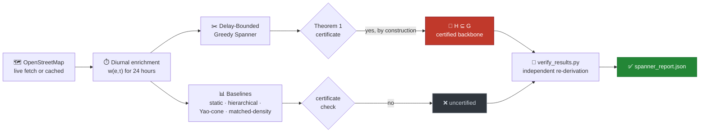
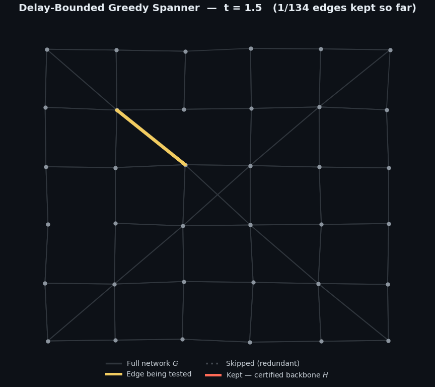
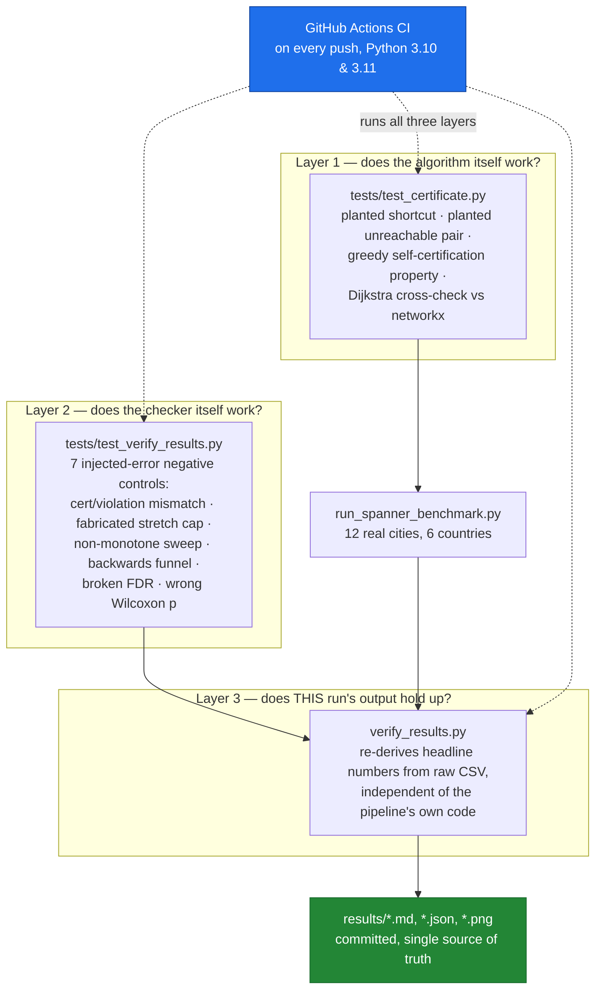

<div align="center">

# 🕸️ Delay-Bounded Time-Varying Geometric *t*-Spanners
### for Urban Road Networks

[](https://github.com/soheylfalahzade/delay-bounded-spanner-networks/actions/workflows/ci.yml)
[](LICENSE)
[](requirements.txt)
[](https://www.openstreetmap.org)
[](results/crosscity_table.md)
[](#1-problem)

**A certified sparsification framework that extracts a single physical road backbone, guaranteed to preserve bounded travel-time dilation at every hour of the day — validated end-to-end on real metropolitan road networks pulled live from OpenStreetMap, across six Iranian and six international cities spanning five distinct street-network morphologies.**

</div>


---

> **Research line.** This repository is the time-varying, delay-bounded branch of a single line of work on geometric spanners: `geometric-spanners-lab` (classical baselines), `Research_Geometric_ML_Optimization` / Geo-SmartSpanner (the same construction problem with ML acceleration), and this repository.

## Research Program

This repository is one component of a connected research program on emergency-aware urban network control. The four repositories share a problem family, not code: each is self-contained and makes claims only within its own tested scope.

| Repository | Setting | Role in the program | Type of guarantee |
| --- | --- | --- | --- |
| [`geometric-spanners-lab`](https://github.com/soheylfalahzade/geometric-spanners-lab) | Euclidean point sets, undirected | Classical greedy t-spanner baseline | Exact by construction; independently re-derived by `verify_independent.py` |
| [`Research_Geometric_ML_Optimization`](https://github.com/soheylfalahzade/Research_Geometric_ML_Optimization) | Directed OpenStreetMap road graphs | Same spanner problem, with learned (GNN + fuzzy) edge pruning for speed | Per-edge local repair guarantee; global stretch validated empirically by Monte Carlo sampling (small nonzero violation rate in one city, disclosed in that repository) |
| **[`delay-bounded-spanner-networks`](https://github.com/soheylfalahzade/delay-bounded-spanner-networks) (this repository)** | Directed road graphs with hourly speed profiles | Same problem under a time-varying delay constraint | Certified: an edge-wise certificate implies the all-pairs, all-hours bound (Theorem 1); congestion model is parametric, not fitted to telemetry |
| [`anti-gridlock-signal-control`](https://github.com/soheylfalahzade/anti-gridlock-signal-control) | Single signalized intersection (SUMO) | Local control layer beneath a future network layer | Empirical (10 paired seeds); no closed-loop stability proof |

**How the pieces fit.** The three spanner repositories form one line of work on sparse backbones of road networks: a classical greedy baseline, a machine-learning-accelerated variant on directed road graphs, and a variant that certifies a delay bound at every hour of the day. The signal-control repository is the local control layer that a network-level layer would sit above.

**Status.** Integration of the local control layer with the network layer is planned and has not been demonstrated. Principal open items per repository:

- `geometric-spanners-lab`: the OpenStreetMap experiments use node coordinates only (Euclidean metric), not road connectivity.
- `Research_Geometric_ML_Optimization`: efficiency does not transfer to Tokyo scale (0.09% of edges pruned), and the ablation study has not yet been re-run on all four cities with the final pipeline.
- `delay-bounded-spanner-networks`: the congestion field is parametric, not fitted to real traffic telemetry.
- `anti-gridlock-signal-control`: fuzzy membership functions are hand-set, only one intersection is tested, and closed-loop stability is open.

## 1. Problem

Let $G = (V, E)$ be a directed geometric road network. Each edge $e$ carries a length $\ell(e)$ and an hourly diurnal speed profile $v(e, \tau)$ for $\tau \in \{0, \dots, 23\}$, giving the time-sliced travel-time cost

$$w(e, \tau) \;=\; \frac{\ell(e)}{v(e, \tau)}$$

We construct a sparse backbone $H \subseteq E$ certified to satisfy

$$\forall\, u, v \in V,\ \ \forall\, \tau \in \{0,\dots,23\}:\qquad \mathrm{dist}_H(u, v, \tau) \;\le\; t \cdot \mathrm{dist}_G(u, v, \tau)$$

> **Theorem 1** *(edge-wise certificate ⇒ all-pairs, all-hours guarantee).*
> If $\mathrm{dist}_H(u,v,\tau) \le t \cdot w((u,v),\tau)$ holds for every edge $(u,v) \in E$ and every hour $\tau$, then $H$ is a delay-bounded time-varying $t$-spanner of $G$.
>
> *Proof.* Fix $\tau$; $w(\cdot,\tau)$ is a static, non-negative weighting, so concatenating the edge-wise invariant along a $\tau$-optimal path and applying the triangle inequality in $H_\tau$ gives the all-pairs bound, independently for every $\tau$. $\blacksquare$

This collapses $|V|^2 \cdot 24$ pairwise constraints into $|E| \cdot 24$ *local* certificates, each decidable by a Dijkstra search pruned to the ball of radius $t \cdot w(e,\tau)$ — the diagram below shows the full pipeline this enables, and the animation under §2 shows the certificate decision actually running.


```mermaid
flowchart LR
    A["🗺️ OpenStreetMap<br/>live fetch or cached"] --> B["⏱️ Diurnal enrichment<br/>w(e,τ) for 24 hours"]
    B --> C["✂️ Delay-Bounded<br/>Greedy Spanner"]
    C --> D{"Theorem 1<br/>certificate"}
    D -- "yes, by construction" --> E["📐 H ⊆ G<br/>certified backbone"]
    B --> F["📊 Baselines<br/>static · hierarchical ·<br/>Yao-cone · matched-density"]
    F --> G{"certificate<br/>check"}
    G -- "no" --> H["❌ uncertified"]
    E --> I["🔁 verify_results.py<br/>independent re-derivation"]
    H --> I
    I --> J["✅ spanner_report.json"]

    style E fill:#c0392b,stroke:#7b0d1e,color:#fff
    style H fill:#30363d,stroke:#8b949e,color:#c9d1d9
    style J fill:#238636,stroke:#196c2e,color:#fff
```

---

## 2. Algorithm — Delay-Bounded Greedy Spanner

$$
\begin{aligned}
&1.\ \ \text{order } E \text{ ascending by } \max_\tau w(e, \tau) \\
&2.\ \ H \leftarrow \varnothing \\
&3.\ \ \text{for } (u, v) \in E \text{ in that order:} \\
&4.\ \ \quad \text{for } \tau \text{ ordered by ascending } w((u,v), \tau):\quad \text{\small(tightest budget first)} \\
&5.\ \ \qquad \beta \leftarrow t \cdot w((u,v), \tau) \\
&6.\ \ \qquad \text{if } \mathrm{BoundedDijkstra}(H, u{\to}v, \tau, \beta) > \beta: \\
&7.\ \ \qquad\quad H \leftarrow H \cup \{(u,v)\};\ \text{break} \qquad \text{\small(early exit)} \\
&8.\ \ \text{return } H
\end{aligned}
$$

Complexity $O(|E| \cdot 24 \cdot |B| \log|B|)$, $|B|$ the size of the local metric ball. The empirical scaling exponent ($T \propto |E|^k$) is measured fresh on every run — see panel (e) of `results/spanner_benchmark.png`.

**This is the actual algorithm running**, not a mockup — the animation below replays the real `_edge_order()` and `bounded_dijkstra()` decisions (from `tools/make_algorithm_animation.py`) on a small toy grid chosen for legibility; it is illustrative/schematic, not a benchmark result, and feeds no number anywhere in this README:

<p align="center">
  
</p>

---

## 3. Baselines compared

| Method | What it is | Certified? |
|---|---|---|
| **Delay-Bounded Spanner (ours)** | Theorem-1 construction above | **Yes, by construction** |
| Static Free-Flow Spanner | Classical greedy spanner on the free-flow snapshot only | No |
| Mean-Temporal Spanner | Greedy spanner on the 24h-averaged cost | No |
| Static Geometric Spanner | Classical Euclidean-length greedy spanner | No |
| Yao-Cone Sparsifier (k=8) | Network-constrained adaptation of the classical Yao graph (cheapest edge per 45° cone per node) — *not* the unconstrained-point-set construction with the closed-form `1/(1-2 sin(π/k))` stretch bound; that bound does not apply here and is not claimed | No |
| Hierarchical Road Classifier | Keep only arterial/collector classes + last-mile attachment | No |
| Matched-Density Random / Betweenness | Density-matched structural controls (same edge budget as ours) | No |
| Full Network | Ground truth (`t = 1`) | — |

---

## 4. Results

Numbers are **not** hand-copied into this README. They live in the auto-generated files below, regenerated fresh by every run of `run_spanner_benchmark.py`, so there is exactly one source of truth and it cannot silently drift out of sync with the code that produced it:

- [`results/benchmark_table.md`](results/benchmark_table.md) — focus-city (default: Yazd) sweep across `t`, all baselines, with 95% CI on mean dilation and the certificate's attained worst-case edge stretch
- [`results/ablation_table.md`](results/ablation_table.md) — edge-ordering ablation (`temporal_max` / `temporal_mean` / `centrality`)
- [`results/crosscity_table.md`](results/crosscity_table.md) — all cities, Iran + international, with data provenance (`OSM` vs `synthetic`), street-orientation entropy, circuity, and the advantage ratio over the matched-density control
- [`results/spanner_report.json`](results/spanner_report.json) — full machine-readable record: every table above plus the morphology regression, the pair-level and city-level significance tests, the FIFO time-dependent validation, and the congestion-model sensitivity sweep
- [`results/spanner_benchmark.png`](results/spanner_benchmark.png) — 7-panel focus-city figure
- [`results/spanner_crosscity.png`](results/spanner_crosscity.png) — 4-panel cross-city generalization figure
- [`results/per_pair_dilation.csv`](results/per_pair_dilation.csv) — raw per-OD-pair dilation at the focus city's peak hour (the raw data behind the significance tests — see §5)

Run `python run_spanner_benchmark.py` to (re)generate all of the above from scratch.

<p align="center">
  
  <br><sub><b>Figure 1.</b> Focus city, real OpenStreetMap data — temporal dilation stability, sparsification vs. permitted dilation, sparsity/fidelity Pareto front, empirical scaling, dilation distribution at the worst hour, and the certified emergency backbone overlaid on the full network.</sub>
</p>

<p align="center">
  
  <br><sub><b>Figure 2.</b> Cross-city generalization — sparsification across all 12 cities, street-morphology regressions, and robustness of the certified bound to congestion-model misspecification.</sub>
</p>

---

## 5. Verification & Reproducibility

This is the section most reviewers skim past and most retractions come from skipping.


```mermaid
flowchart TD
    subgraph L1["Layer 1 — does the algorithm itself work?"]
        T1["tests/test_certificate.py<br/>planted shortcut · planted unreachable pair ·<br/>greedy self-certification property ·<br/>Dijkstra cross-check vs networkx"]
    end
    subgraph L2["Layer 2 — does the checker itself work?"]
        T2["tests/test_verify_results.py<br/>7 injected-error negative controls:<br/>cert/violation mismatch · fabricated stretch cap ·<br/>non-monotone sweep · backwards funnel ·<br/>broken FDR · wrong Wilcoxon p"]
    end
    subgraph L3["Layer 3 — does THIS run's output hold up?"]
        T3["verify_results.py<br/>re-derives headline numbers from raw CSV,<br/>independent of the pipeline's own code"]
    end
    T1 --> RUN["run_spanner_benchmark.py<br/>12 real cities, 6 countries"]
    T2 --> T3
    RUN --> T3
    T3 --> OUT["results/*.md, *.json, *.png<br/>committed, single source of truth"]
    CI["GitHub Actions CI<br/>on every push, Python 3.10 &amp; 3.11"] -. runs all three layers .-> T1
    CI -.-> T2
    CI -.-> T3

    style OUT fill:#238636,stroke:#196c2e,color:#fff
    style CI fill:#1f6feb,stroke:#0d419d,color:#fff
```

Concretely, this repo has:

**Unit tests** (`tests/test_certificate.py`, `python -m unittest discover -s tests -v`) — analytically-known positive and negative controls run against the *actual* production functions, not a reimplementation:
- a planted shortcut edge whose removal must break certification with an **exactly** computable attained stretch (`6.0`, hand-derived);
- a planted unreachable pair, which must be reported as `∞`, not a finite guess;
- a property test that the greedy construction always self-certifies against its own parent graph, across multiple random seeds and `t` values;
- an independent cross-check of the core `bounded_dijkstra` primitive against `networkx`'s own (separately implemented, widely trusted) shortest-path routine, on 20 random graphs.

**An independent verifier** (`verify_results.py`) — deliberately *not* part of the pipeline, imports none of its aggregation code, and re-derives headline numbers (worst/mean dilation, the Wilcoxon p-value) straight from the raw `per_pair_dilation.csv` using a separate pandas/scipy code path, then checks them against what the pipeline itself reported. Eight independent checks in total: certificate internal consistency, the anti-fabrication check for the bug below, re-derived dilation statistics, a re-derived Wilcoxon p-value, sparsification monotonicity in `t`, cross-city data provenance, a connectivity-funnel sanity check (an SCC/contraction filter can only remove nodes or edges, never add them), and a Benjamini-Hochberg FDR-correction sanity check (an adjusted p-value can never be smaller than its own raw p-value) on the multi-comparison morphology regression. Paths are CLI-overridable (`--results-dir`, `--report`, `--perpair`) specifically so it can be driven in isolation by tests, not only by eyeballing a terminal.

**The verifier is tested against itself** (`tests/test_verify_results.py`) — a minimal, fully synthetic report is built in-memory, and each test corrupts exactly one thing (a `certified: true` paired with nonzero violating edges, a fabricated repeated stretch cap, non-monotone sparsification, a connectivity funnel running backwards, a broken FDR correction, a reported Wilcoxon p-value that doesn't match what scipy actually computes from the raw data) and asserts `verify_results.py` catches that *specific* failure, with every other check still passing. Without this, "we have a verifier" is just as unverifiable a claim as anything it checks.

**Continuous integration** (`.github/workflows/ci.yml`) — on every push: byte-compile, all unit tests (certificate controls + the verifier's own negative controls), a full `--quick --synthetic` pipeline run, and `verify_results.py` against its output, on Python 3.10 and 3.11.

**Graph caching for cold reproducibility** (`results/graph_cache/`) — every fetched or synthesized road network is cached (pickle + a small, git-trackable `.meta.json` sidecar recording fetch time, source, node/edge counts). A later run reproduces the exact same graph offline; `--refresh-cache` forces a clean refetch.

### A documented correction

An earlier version of `temporal_stretch_certificate()` refined violating edges with a *bounded* search (`budget = 8× the edge's own cost`) and, on timeout, silently reported `attained_worst_edge_stretch = 8.0` for **every** such case — a fixed search-cutoff artifact, not a measured value, and it looked exactly like the kind of suspiciously round, repeated number that should be distrusted rather than reported at face value. It was caught by inspection, not by a test (the test that would have caught it, `TestUnreachableViolationIsReportedAsInfinity`, was written afterward specifically so it can't recur silently). The fix runs a genuinely unbounded search on refinement: violating edges get their true attained stretch, and truly unreachable pairs are now reported honestly as `∞ (n unreachable)` rather than a fabricated finite number. Tables now show `≥X` when the search was truncated before refining every violation (a disclosed lower bound, never a silent cap).

### What is *not* yet independently validated

- The diurnal congestion field is a **parametric** model (tidal, CBD-weighted, inbound/outbound-asymmetric), not fitted to floating-car or loop-detector telemetry. `results/spanner_report.json → congestion_sensitivity` quantifies robustness to this choice (±30% severity) but does not substitute for a telemetry-fitted replication.
- **Congestion model vs. measured traffic: not validated.** The parametric diurnal congestion model has **not** been compared against measured hourly traffic data for any of the twelve cities. A shape-only comparison against NYC DOT Traffic Speeds (Manhattan) was prepared (`tools/validate_congestion_shape.py`), but the data endpoint was not reachable from the authors' network, so no result is reported.
- Twelve cities across six countries support a *directional* cross-morphology, cross-country generalization claim (`morphology_regression`, `city_level_significance`, `iran_vs_international_comparison` in the report) — not a definitive one. City-level tests are underpowered by design (n = cities, not OD pairs); they are reported with that caveat rather than presented as confirmatory.
- Cities whose live OSMnx/Overpass fetch is unavailable fall back to a deterministic, morphology-parameterized synthetic generator. Every city's `used_real_osm` flag states which was used for that specific run — check it before citing a number as coming from real map data.

---

## 6. Reproduce

```bash
conda create -n spanner_research_env python=3.10 -y
conda activate spanner_research_env
conda install -c conda-forge networkx osmnx geopandas shapely scipy numpy pandas matplotlib seaborn tqdm -y

python -m unittest discover -s tests -v           # unit tests
python run_spanner_benchmark.py                    # full run: focus city + 12-city cross-city study
python verify_results.py                           # independent check of what was just produced

python run_spanner_benchmark.py --quick             # fast smoke test (stratified Iran + international)
python run_spanner_benchmark.py --synthetic         # force offline mode everywhere
python run_spanner_benchmark.py --skip-crosscity    # focus city only
python run_spanner_benchmark.py --refresh-cache      # ignore the graph cache and refetch/rebuild
```

If Overpass/OSMnx is unreachable, the pipeline transparently falls back to the deterministic synthetic generator and labels each city's `used_real_osm` flag accordingly — it never silently mixes real and synthetic data without saying so.

---

## 7. Repository layout

```
.
├── run_spanner_benchmark.py       # single self-contained pipeline (model, algorithm, baselines, eval, figures)
├── verify_results.py              # independent verification, separate code path from the pipeline
├── tests/
│   ├── test_certificate.py        # unit tests: positive/negative controls + independent Dijkstra cross-check
│   ├── test_verify_results.py     # negative controls proving the verifier itself catches injected errors
│   └── test_congestion_shape.py   # unit tests + negative controls for the congestion-shape validator
├── tools/
│   ├── make_algorithm_animation.py  # regenerates assets/algorithm_demo.gif from the real algorithm
│   └── validate_congestion_shape.py # shape-only check of the congestion model vs measured NYC DOT speeds (not yet run: data unreachable)
├── assets/
│   └── algorithm_demo.gif         # illustrative only — not a benchmark result, feeds no number in this README
├── .github/workflows/ci.yml       # unit tests + smoke run + verification, on every push
├── requirements.txt
├── LICENSE
├── CITATION.cff
├── README.md
└── results/
    ├── spanner_benchmark.png
    ├── spanner_crosscity.png
    ├── spanner_report.json
    ├── benchmark_table.md
    ├── ablation_table.md
    ├── crosscity_table.md
    ├── per_pair_dilation.csv
    └── graph_cache/               # .meta.json tracked; .pkl gitignored (see .gitignore)
```

---

## Related Work

<!-- TODO: verify every bibliographic entry below against the publisher record. -->

**Spanners.** The greedy construction and its size bounds are due to Althofer, Das, Dobkin, Joseph and Soares (1993); Peleg and Schaffer (1989) introduced graph spanners; Narasimhan and Smid (2007) is the standard monograph on geometric spanner networks, and Yao (1982) introduced the cone-based sparsification used here as a baseline. Fault-tolerant geometric spanners were studied by Levcopoulos, Narasimhan and Smid (1998). These works treat static, undirected edge weights; the present work differs in that the cost of each edge varies with the hour of day and the network is directed.

**Time-dependent routing.** Cooke and Halsey (1966) and Orda and Rom (1990) established shortest-path computation when edge costs depend on time, including the FIFO property that this repository validates empirically. Geisberger, Sanders, Schultes and Delling (2012) give contraction hierarchies, the dominant practical speed-up for static road graphs; hierarchical road classes appear here only as a baseline.

**Data.** Road networks are obtained with OSMnx (Boeing, 2017) from OpenStreetMap.

### References

- Althofer, I., Das, G., Dobkin, D., Joseph, D., Soares, J. (1993). On sparse spanners of weighted graphs. *Discrete & Computational Geometry* 9(1), 81-100.
- Boeing, G. (2017). OSMnx: New methods for acquiring, constructing, analyzing, and visualizing complex street networks. *Computers, Environment and Urban Systems* 65, 126-139.
- Cooke, K. L., Halsey, E. (1966). The shortest route through a network with time-dependent internodal transit times. *Journal of Mathematical Analysis and Applications* 14(3), 493-498.
- Geisberger, R., Sanders, P., Schultes, D., Delling, D. (2012). Exact routing in large road graphs: contraction hierarchies. *Transportation Science* 46(3), 388-404.
- Levcopoulos, C., Narasimhan, G., Smid, M. (1998). Efficient algorithms for constructing fault-tolerant geometric spanners. *Proc. 30th ACM STOC*.
- Narasimhan, G., Smid, M. (2007). *Geometric Spanner Networks*. Cambridge University Press.
- Orda, A., Rom, R. (1990). Shortest-path and minimum-delay algorithms in networks with time-dependent edge-length. *Journal of the ACM* 37(3), 607-625.
- Peleg, D., Schaffer, A. A. (1989). Graph spanners. *Journal of Graph Theory* 13(1), 99-116.
- Yao, A. C.-C. (1982). On constructing minimum spanning trees in k-dimensional spaces and related problems. *SIAM Journal on Computing* 11(4), 721-736.

## 8. Known limitations

- Snapshot (time-slice) model: no departure-time evolution *within* a single traversal; ex-post validated by a FIFO time-dependent Dijkstra experiment (`fifo_violation_rate` in `results/spanner_report.json`).
- Congestion is a parametric model, not measured telemetry — see §5.
- Greedy construction carries no approximation guarantee on `|H|`; the matched-density and Yao-cone baselines are empirical, not theoretical, lower-bound proxies.
- Twelve cities is enough for a directional generalization claim, not a definitive one — see §5.

---

## 9. Related Work

**Fault-tolerant geometric spanners.** Abam, de Berg, Farshi and Gudmundsson study spanners that keep their stretch guarantee after all vertices inside a geometric region fail, and they also treat a geodesic variant in which the faulty set is a disk [1]. Our setting differs: no vertices fail, but edge costs change with the hour of day. The two share the idea that one sparse subgraph must certify a stretch bound under a family of scenarios (failure regions there, hours τ ∈ {0..23} here).

**Experimental evaluation of spanner algorithms.** Farshi and Gudmundsson compare geometric t-spanner constructions empirically, in terms of quality and running time [2, 3]. We follow this empirical tradition, but on real road networks with time-dependent travel cost rather than Euclidean point sets.

**Improving stretch by augmentation.** Farshi, Giannopoulos and Gudmundsson study how adding edges to a geometric network reduces its stretch factor [4]; our certificate is a sparsification-side counterpart, deciding which edges can be dropped without breaking the bound.

**Weighted point sets.** Abam et al. construct spanners for point sets with weights [5], whereas we place the weights on the edges and let them vary over time.

**References**

1. M. A. Abam, M. de Berg, M. Farshi, J. Gudmundsson. Region-fault tolerant geometric spanners. *Discrete & Computational Geometry* 41(4):556–582, 2009. doi:10.1007/s00454-009-9137-7
2. M. Farshi, J. Gudmundsson. Experimental study of geometric t-spanners. *ACM Journal of Experimental Algorithmics* 14, Article 1.3, 2010 (conference version: ESA 2005, pp. 556–567).
3. M. Farshi, J. Gudmundsson. Experimental study of geometric t-spanners: a running time comparison. WEA 2007, pp. 270–284.
4. M. Farshi, P. Giannopoulos, J. Gudmundsson. Improving the stretch factor of a geometric network by edge augmentation. *SIAM Journal on Computing* 38(1):226–240, 2008.
5. M. A. Abam, M. de Berg, M. Farshi, J. Gudmundsson, M. Smid. Geometric spanners for weighted point sets. *Algorithmica* 61(1):207–225, 2011.

## 10. Citation

See [`CITATION.cff`](CITATION.cff), or:

```bibtex
@software{delay_bounded_spanner_2026,
  title  = {Delay-Bounded Time-Varying Geometric t-Spanners for Urban Road Networks},
  author = {Soheil},
  year   = {2026},
  license = {MIT},
  note   = {Certified temporal sparsification, validated on real OpenStreetMap road networks across six Iranian and six international cities}
}
```
